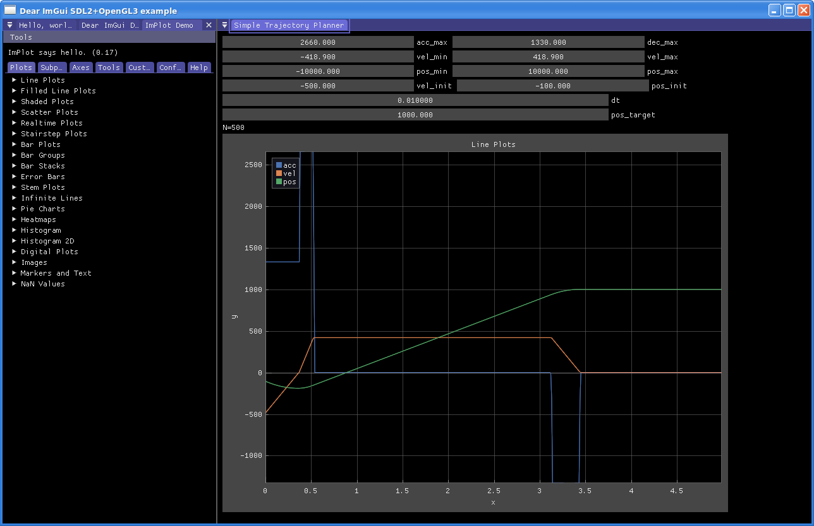

# Trapezoidal Trajectory Planner

This is a Dear ImGui based test program for an on-line
trapezoidal trajectory planner.



[`mc_traj.c`](src/mc_traj.c) is where are all the magic happens.

## Build

### Linux

```
mkdir -p build
cd build
cmake ..

make

./mc_traj_test
```

### Windows

The project can also be compiled for Windows using
Microsoft Visual Studio 2022 or later.

Needs `SDL2-devel-2.30.3-VC.zip`.
